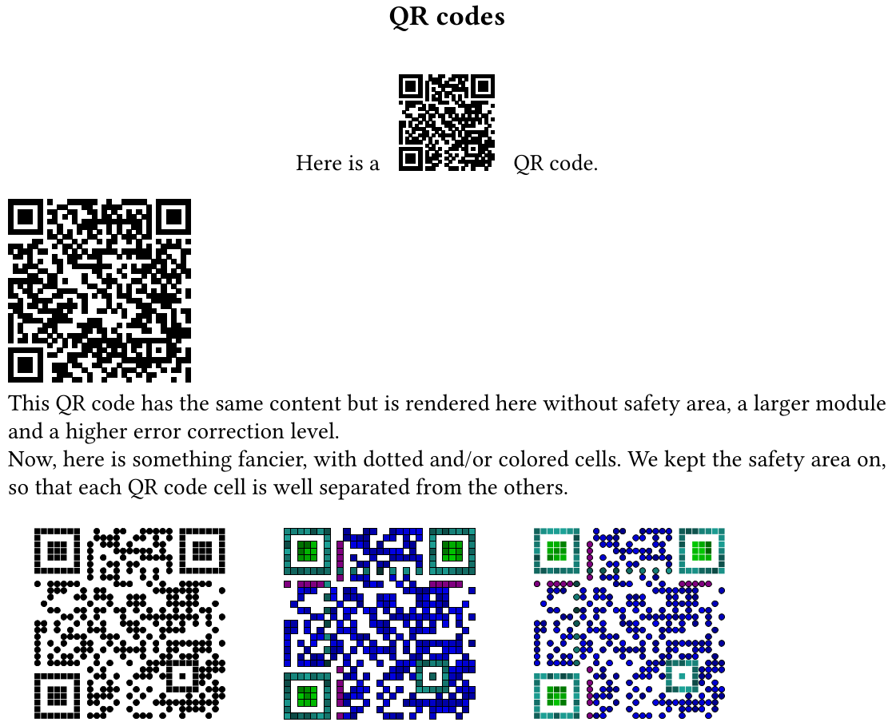

# qrcode.sile

[](LICENSE)
[](https://github.com/Omikhleia/qrcode.sile/actions?workflow=Luacheck)
[](https://luarocks.org/modules/Omikhleia/qrcode.sile)

This package for the [SILE](https://github.com/sile-typesetter/sile) typesetting system aims at providing QR code support.

It provides the `qrcode` package, which allows printing out a QR code in documents.



On a slightly related topic, you might also be interested in the [barcodes.sile](https://github.com/Omikhleia/barcodes.sile) package set.

## Installation

This package requires SILE v0.15.12.

Installation relies on the **luarocks** package manager.

To install the latest version, you may use the provided “rockspec”:

```
luarocks install qrcode.sile
```

(Refer to the SILE manual for more detailed 3rd-party package installation information.)

## Usage

Examples are provided in the [examples](./examples) folder.

 - Customizable size and error correction level.
 - Option for disabling the quiet zone (safety margin).
 - Colors and/or dotted patterns for nice effects on poster designs. 
 - Logo image in the center of the QR code, if you do not mind the loss of some error recovery capacity.

The in-code package documentation may also be useful.
A readable version of the documentation is included in the User Manual for the [resilient.sile](https://github.com/Omikhleia/resilient.sile) collection of classes and packages.

## License

All SILE-related code and samples in this repository are released under the BSD 3-clause license, (c) 2022-2025 Omikhleia.

A **modified** copy of the [luaqrcode](https://github.com/speedata/luaqrcode) QR code library is distributed alongside this package.
All corresponding files (in the `lua-libraries` folder) are released under the BSD 3-Clause license, (c) 2012-2020, Patrick Gundlach (SPEEDATA GMBH) and contributors.
Modifications are traced with an `OMIKHLEIA` comment in the code.
